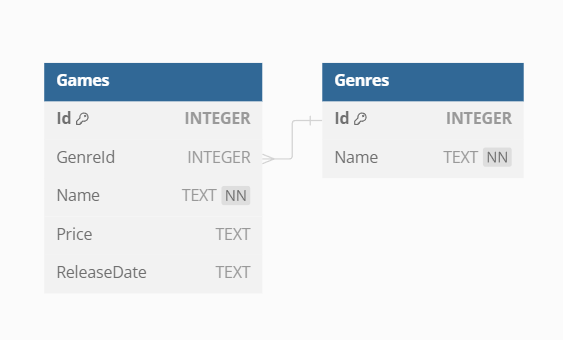

# Game Store

## Project Info

This is a simple project for a game store. It is called a simple project because it only contains 2 tables in the database, namely the Genre table and the Games table with a one-to-many relationship.

Basically, this project just displays a list of the games that are sold. Then, we can add new game data, then we can change the game data, and even delete the game data.

This project is divided into 2 folders:

1. Frontend
    * Blazor
    * Bootstrap
    * .NET8
2. Backend (RESTful API)
    * .NET8
    * SQLite

## Entity Relationship Diagram

## How to Run

How to run the project:

1. Clone this repo
2. Open the GameStore.Api folder
    * run the command `dotnet run`
3. Open the GameStore.Frontend folder
    * run the command `dotnet watch`
4. Enjoy this simple project

## Endpoints

### Frontend

| URI      | Description           |
| -------- | --------------------- |
| `/`      | index (home page)     |

### Backend

| Method   | URI         | Description            |
| -------- | ----------- | ---------------------- |
| GET      | `/genres`    | Display all genres from database |
| GET      | `/games`    | Display all games from database |
| GET      | `/games/:id`  | Display specific game from database by ID |
| POST     | `/games`  | Create new game data to database |
| PUT      | `/games/:id`  | Update a specific game data from database by ID |
| DELETE   | `/games/:id`  | Delete a specific game from database by ID |

## Additional Info
My documentation in this project:
* [about Blazor](https://github.com/pockypoem/dotnet-core/tree/main/theory/blazor-theory)
* [about RestAPI](https://github.com/pockypoem/dotnet-core/tree/main/theory/restapi-theory)

**Don't forget to star this repository if you find it useful.🌟😆**