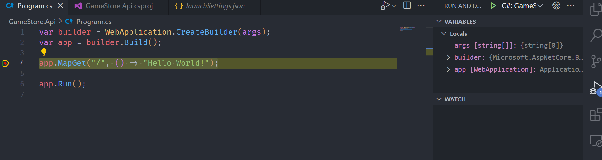

## What are you going to build:
  

* the frontend part using blazor is on [this video](https://youtu.be/RBVIclt4sOo?si=dcwnIIcGny1S6-OW)

## What this course covers
* Create ASP.NET Core Apps
* Understand REST APIs
* Implement CRUD Endpoints
* Data Transfer Objects (DTOs): to define the contract between API and frontend
* Extension Methods
* Route Groups
* Handle Invalid Inputs
* Entity Framework Core
* Configuration System
* Dependency Injection
* Service Lifetime
* Mapping Entities to DTOs
* Asynchronous Programming
* Frontend Integration

## Is this course for you?
* Basic C# or Java Knowledge
* Web Development Essentials
* Some Database Experience
* Beginner Level Tutorial

## Software Prerequisites
* [.NET](https://dotnet.microsoft.com/en-us/download)
* [Visual Studio Code](https://code.visualstudio.com/)

## Create Project
* `dotnet new list`: list of application template that you can create with your sdk
* atau bisa juga: ctrl + shift + p (buka command palete)
* .NET: New Project
* Lalu akan buka list template project yang tersedia
* Choose: ASP.NET Core Web API (if you already knew)
* but if you are beginner, choose: ASP.NET Core Empty [Choose this]
* pilih folder tempat project
* buat folder nama project
* kasih nama projects `GameStore.Api`

How to build:
* solution explorer > GameStore.Api > right click > build
* in folder .bin, you will find GameStore.Api.dll as a form of assembly compiler by C#

or
* open terminal
* `dotnet build`

How to run:
* press F5 (to select debugger)
* choose C#
* select launch configuration
* C#: Default Configuration and then will run the localhost

  

> is not just only run the application but also in debug session

Prove, we are on debug session:  

If you want to run your app without debugging session:  
 

or use terminal: `cd GameStore.Api` > `dotnet run`

## Packages:
* https://www.nuget.org/ for filtering API and can combine with data annotation to handle invalid input