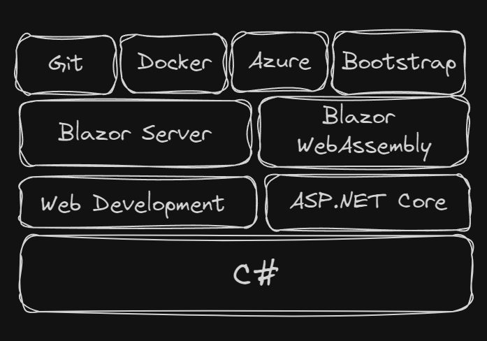

# How to Learn Blazor?

Source: [Youtube video](https://youtu.be/GIcAADklnRo?si=OoT6K2AnRkWjX6Ci)

## Blazor FAQs
1. Can I get a job with Blazor?
    * blazor is part of ASP.NET Core and that includes MVC, API, Razor Pages, Blazor Server, Blazor Webassembly
    * you will absolutely get a job with blazor
    * blazor is mature and that's something companies love to see is a mature framework
2. Should i learn Blazor or MVC?
    * yes, learn them both
    * you should learn Blazor first because that's the more modern framework
    * MVC is very popular in .NET space because the fact that it was in .NET framework and so it has a much longer life span.
3. Is Blazor better than Angular / React / Vue?
    * No
    * Is Blazor worse than Angular / React / Vue? No! It's different
    * There's no the best because it depends on your situation
    * If you already have the investment in all that C# knowledge than Blazor is a good choice
4. Will my Blazor skills help me in other areas?
    * Absolutely, because you're doing c# work and so it's going to stretch and improve your c# skill, your oop skill
5. Which Blazor should i learn?
    * just blazor for the most part

## Blazor Flavors
* Blazor Server
    * A server-side app that acts like a client-side app. Creates simple applications that are easy to maintain.
    * If it go offline, the website can't be accessed
    * Blazor server is mature
* Blazor WebAssembly
    * A fully client-side app that can work offline and be a progressive web app
    * work like react / vue / angular
    * it can't do the server side stuff (it can't directly access the database)
* Blazor Hybrid
    * A desktop / mobile app framework that is powered by MAUI (Multiple Application User Interface -> it's the replacement to xamarin). A brand-new system that is still growing
    * It's new so there'll be some changes to it in order to kind of get to that mature state

## Learning Order

## Learning Steps
1. Learn a small topic or item.
2. Practice the basics
3. Practice the edge cases
4. Repeat!

## The Easy Path
1. C# mastercourse
2. Web Development Mastercourse
3. ASP.NET Core From Start to Finisih
4. .NET Core Dependency Injection From Start to Finish
5. .NET Core Appsettings From Start to Finish
6. Blazor Server From Start to Finish
7. Azure From Start to Finish
8. Build a Suggestion Site App

## Tips and Tricks
1. Practice isn't extra, it is essential
2. Don't skip the "easy stuff" like HTML
3. Stick to the pland and **learn in order**
4. Pace yourself
5. Evaluate your progress and continually improve