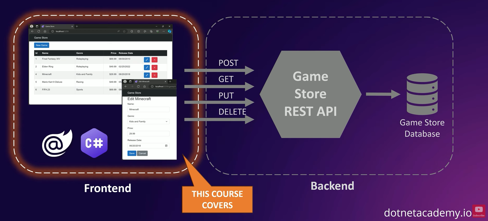

https://dotnet.microsoft.com/en-us/apps/aspnet/web-apps/blazor

## What are you going to build

## What this course covers
* Work with Blazor Projects
* Use Razor syntax
* Style with Bootstrap
* Create and reuse components
* Use Forms and bindings
* Client-side validation
* Dependency injection
* Routing and navigation
* Use component parameters
* Add user interactivity
* Use the configuration system
* Use asynchronous programming
* Talk to the backend via HttpClient
* Stream rendering & enhanced forms

## Is this course for you?
* Basic C# or Java knowledge
* HTML & CSS Essentials
* Beginner Level Course

## Software prerequisites
* .NET SDK
* Visual Studio Code

## Styling with bootstrap
* https://getbootstrap.com/
* [ASP.NET Core Razor Component Lifecycle](https://learn.microsoft.com/en-us/aspnet/core/blazor/components/lifecycle?view=aspnetcore-8.0)