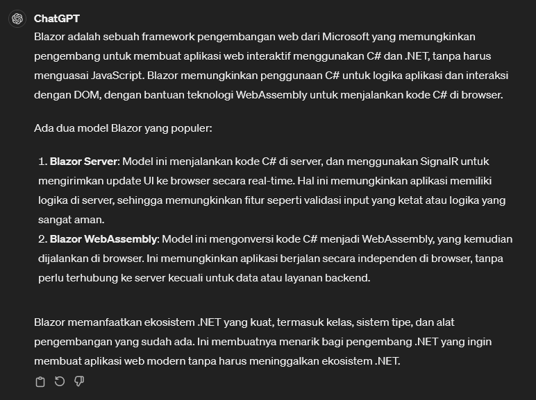
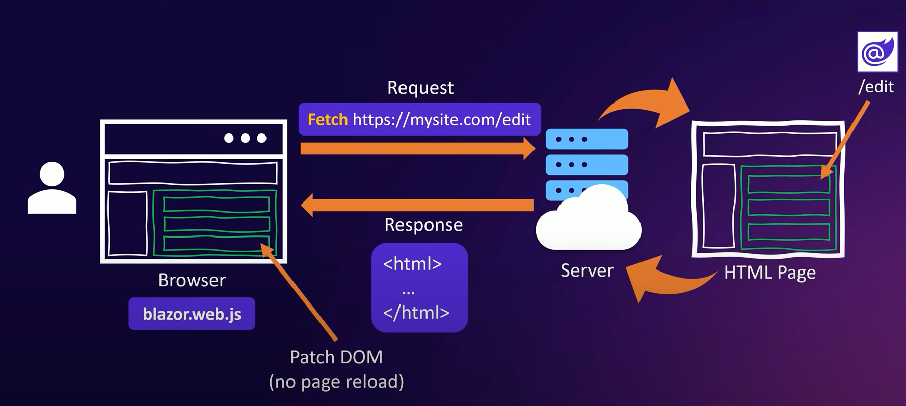

# Blazor

## What is Blazor?
> Blazor is a modern web framework for building interactive Web UIs using HTML, CSS, and C#

 

## A component based Web UI framework

## A single page application (like) framework

## Create Blazor Project
* `cd GameStore`
* Terminal: `dotnet new blazor --help`: to see many different options in template
* Terminal: `dotnet new blazor --interactivity None --empty -n GameStore.Frontend`

* `app.UseHsts();` and `app.UseHttpsRedirection();` to make sure that your application can only work with https and not with standard http.
* `app.UseStaticFiles();` adalah metode yang digunakan dalam ASP.NET Core untuk menambahkan middleware yang memungkinkan server web untuk menyajikan file statis seperti gambar, file CSS, file JavaScript, dan file lainnya kepada pengguna.
* `app.MapRazorComponents<App>();` adalah metode yang digunakan dalam Blazor untuk menambahkan routing untuk komponen Razor yang didefinisikan dalam aplikasi.