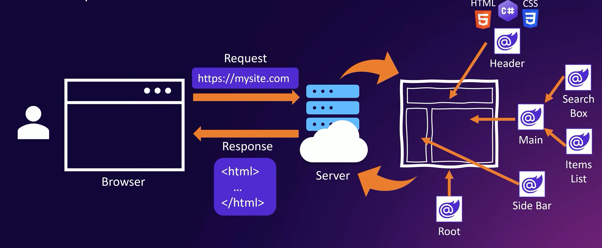

# Blazor

## What is Blazor?
> Blazor is a modern web framework for building interactive Web UIs using HTML, CSS, and C#

 

## A component based Web UI framework

## A single page application (like) framework

## Create Blazor Project
* `cd GameStore`
* Terminal: `dotnet new blazor --help`: to see many different options in template
* Terminal: `dotnet new blazor --interactivity None --empty -n GameStore.Frontend`

* `app.UseHsts();` and `app.UseHttpsRedirection();` to make sure that your application can only work with https and not with standard http.
* `app.UseStaticFiles();` adalah metode yang digunakan dalam ASP.NET Core untuk menambahkan middleware yang memungkinkan server web untuk menyajikan file statis seperti gambar, file CSS, file JavaScript, dan file lainnya kepada pengguna.
* `app.MapRazorComponents<App>();` adalah metode yang digunakan dalam Blazor untuk menambahkan routing untuk komponen Razor yang didefinisikan dalam aplikasi.

## Razor Component Life Cycle

## Fyi about Blazor
Blazor mengkompilasi kode C# Anda menjadi WebAssembly saat aplikasi dimuat di browser. Hal ini memungkinkan Anda menulis kode C# yang menjalankan logika aplikasi Anda langsung di browser tanpa memerlukan JavaScript.

Blazor juga memiliki kemampuan untuk berinteraksi dengan DOM (Document Object Model) menggunakan fitur-fitur seperti "Razor Components" yang dapat mengubah tampilan berdasarkan perubahan data dan peristiwa yang terjadi di aplikasi Anda. Meskipun demikian, Blazor tetap menggunakan JavaScript di bawah layar untuk beberapa fungsi tertentu yang tidak didukung oleh WebAssembly, seperti pengaturan waktu, animasi, dan interaksi dengan API browser tertentu.

### Seputar Web Assembly
* [Dokumentasi Web Assembly](https://webassembly.org/)
* 

## Asynchronous Programming in ASP.NET Core
  

## Stream Rendering
* [Stream Rendering](https://chrissainty.com/blazor-in-dotnet-8-server-side-and-streaming-rendering/)

Jadi misal kita coba untuk slow down aplikasi kita. Mari coba kasih delay 3s di bagian Backend:  
  

Maka kita bisa menggunakan Stream Rendering untuk menampilkan UI HTML sementara sambil menunggu data berhasil di load dari server, caranya dengan inject stream rendering ke dalam app blazor kita:  
  

> Jadi makesure untuk selalu menggunakan Stream Rendering untuk memastikan user experience berjalan dengan lancar

## Another Concept
maybe kita akan dealing with static form and this improvement is very essential.

Mari kita disabled dulu `@rendermode InteractiveServer` yang ada di EditGame.Razor. supaya form kita menjadi static.

Kalau kita coba untuk edit salah satu game lalu kita save update, maka entire home page got reloaded.  

  

banyak yang di-load, ga hanya post request dan get request tapi juga file css dan js nya dan lain-lain. Mungkin itu ga terlalu terasa kalau di local, tapi kalau kita deploy app itu, this isn't going to look very nice. It will taking time to load with all the files that are involved.

In static form, there is a nice way to not have to deal with this kind of experience.

Caranya di EditGame Form coba tambahkan:  

 

This enhanced attribute is going to enable enhance forms so they can behave in a similar way as a single page application. Only that changes is going to be rendered in the page as opposed to having to reload that entire page.

Result:  
  

so there is no need to reload the entire set of elements for the page but only we will go ahead and reconstruct the pieces of HTML that change it when we move back into the home component

But this is the same behaviour that you would observe if you have interactive enable for the form but if you have a static form: you want to make sure that you enable this `Enhance` behaviour cause it will producing a very interactive and nicely loading component