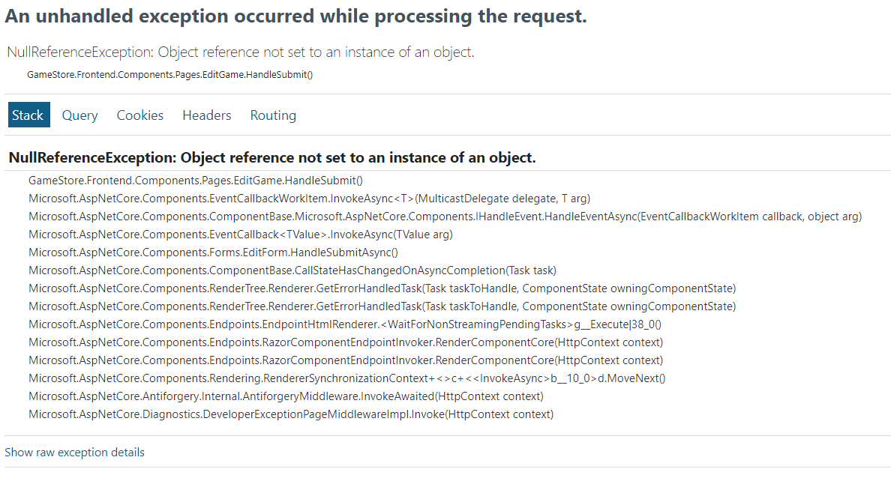

# Dependency Injection

* [Dokumentasi ASP.NET Core Blazor dependency injection](https://learn.microsoft.com/en-us/aspnet/core/blazor/fundamentals/dependency-injection?view=aspnetcore-8.0)


 <br>

 <br>

* Hot reload of .NET was not able to handle the fact that we have injected a brand new service into our page
* just restart and `dotnet watch`


## Info
dengan adanya kode berikut:
```csharp
builder.Services.AddHttpClient<GamesClient>(
    client => client.BaseAddress = new Uri(gameStoreApiUrl)
);

builder.Services.AddHttpClient<GenresClient>(
    client => client.BaseAddress = new Uri(gameStoreApiUrl)
);
```

maka kode di bawah ini bisa dihapus: 
```csharp
// just one instance across the lifetime
builder.Services.AddSingleton<GamesClient>();
builder.Services.AddSingleton<GenresClient>();
```

**Alasannya:** <br>
Dengan menggunakan `AddHttpClient<T>`, kita tidak perlu lagi menggunakan `AddSingleton<T>()` karena HTTP client yang dihasilkan sudah cukup efisien dan cukup fleksibel untuk digunakan di berbagai bagian aplikasi. Selain itu, penggunaan singleton untuk objek HTTP client dapat menyebabkan masalah jika objek tersebut perlu diperbarui (misalnya, konfigurasi base URL yang berubah), karena instance singleton tidak akan secara otomatis diperbarui.