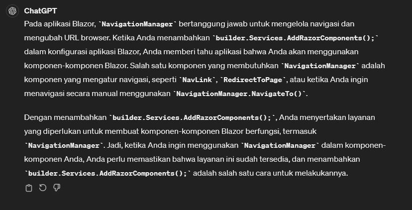

# Dependency Injection

* [Dokumentasi ASP.NET Core Blazor dependency injection](https://learn.microsoft.com/en-us/aspnet/core/blazor/fundamentals/dependency-injection?view=aspnetcore-8.0)

  

  

* Hot reload of .NET was not able to handle the fact that we have injected a brand new service into our page
* just restart and `dotnet watch`