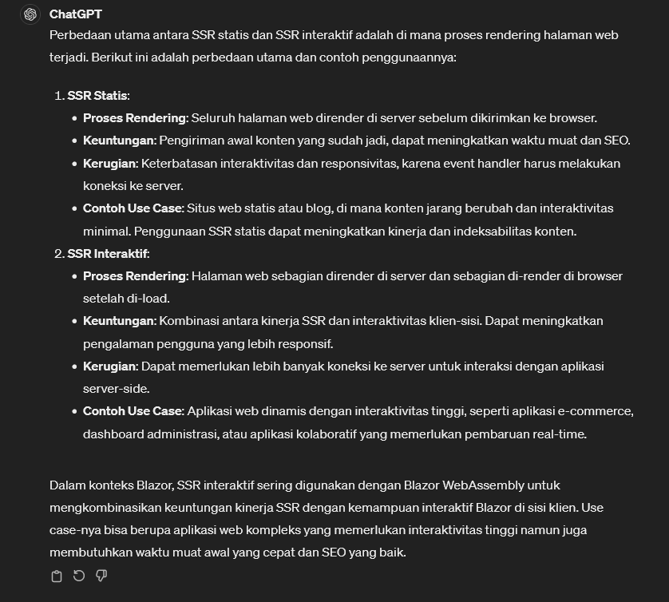

# Understanding Render Modes

## Blazor Render Modes

Blazor support 4 render modes:
1. Static Server-Side Rendering
2. Interactive Server-Side Rendering
3. Client-Side Rendering (via WebAssembly)
4. Automatic Rendering

## Static Server-Side Rendering (static SSR)

  

* is the mode you have been using so far in this course
* in this mode, after browser sends an HTTP request to the server-side blazor app:
    * Components just render HTML to the response stream
    * Components are statistically render on the server and interactivity isn't enabled
        * so for instance a component renders a button and the user clicks on it, nothing will happen since there can't be any event handlers for it
    * Static SSR is default render mode for all components and its best used for websites when content doesn't change frequently and there's no need for realtime user interaction
    * This mode is great for scale since it doesn't require any websocket connections with the server and it also doesn't require any webassembly downloads into the user's browser
    * Has SPA-like responsiveness *(also it enables enhanced navigation by default which enables single page navigation like responsiveness even when it uses traditional server rendered HTML)*

## Interactive Server-Side Rendering (interactive SSR)
  

* renders components from the server in a similar way to a static SSR
* components can process UI events interactively via C# code as opposed to needing Javascript
* UI interactions are handled over a WebSocket connection via SignalR between the browser and the blazor server application
    * so if a component renders a button and the user clicks on it, the event will reach a server via the websocket and the response HTML will comeback to the browser via the same channel
* Best when (real-time) interactivity requires server processing
* Ideal when WebAssembly isn't practical due to size

## Client-Side Rendering (WebAssembly)
.png)  

* Renders components on the client using Blazor WebAssembly (is a technology that allows code reading in different languages to run in a browser and blazor webassembly includes a version of the .net runtime that is donwloaded and cache in the browser with your application)
* Components can process UI events via C# code
* UI interactions are handled entirely in the browser (and your app can update the UI in real time in response to client side events)
* Components can function offline once downloaded and cached in the browser
* it is best for application that require rich interactivity with the UI without constant server communication

## Automatic Rendering
  

* Components are initially rendered with interactive server side rendering
* The .NET runtime and app bundle are downloaded to the client in the background
* On subsequent visits components are rendered from the client using blazor wasm
* This mode takes the best of interactive SSR and client side rendering
* Ideal for apps that need to load quickly but later can transition to rich interactivity in the browser (all without the user noticing the transition from one mode to the other)

# Additional Info

## Static SSR & Interactive SSR
 

## Client Side Rendering & Automatic Rendering
