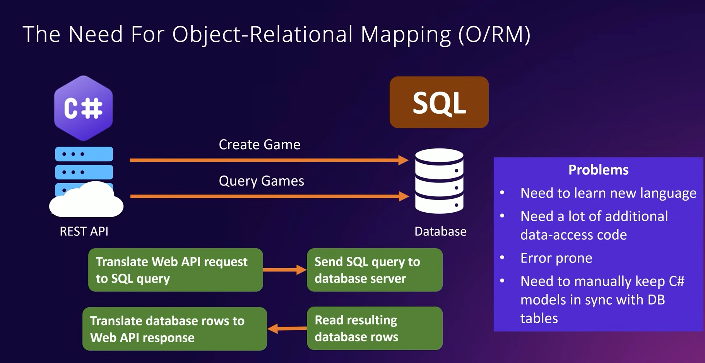
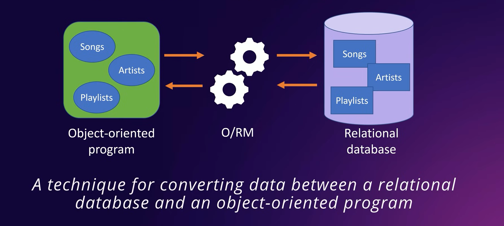
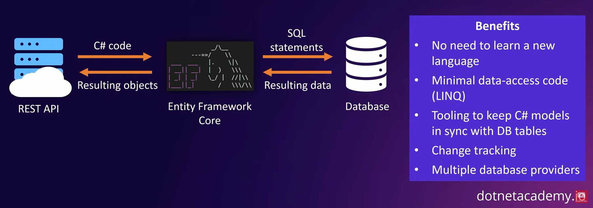
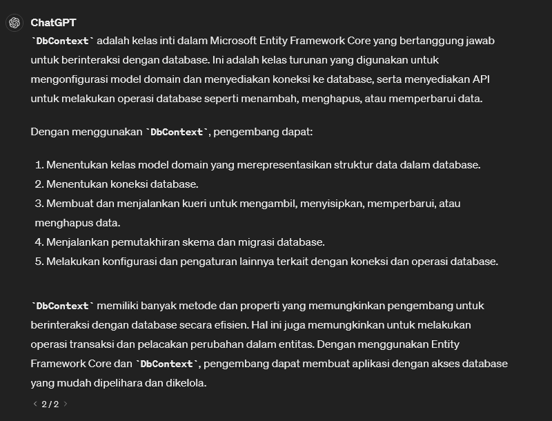
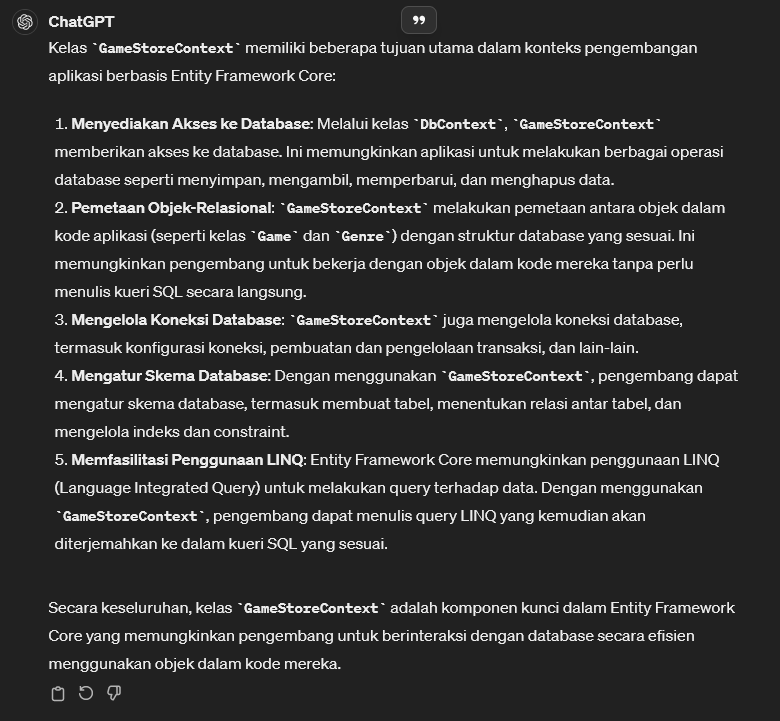

# Entity Framework Core

## The Need for Object-Relational Mapping (O/RM)

## What is Object Relational Mapping (O/RM)?

## What is Entity Framework Core?
> A lightweight, extensible, open source, and cross-platform object-relational mapper for .NET

 

----
Entities folder represent our data model

* DBContext is really an object that represents a session with database and that can be used to query and save instances of your entities

 

Kegunaan `GameStoreContext`:  
