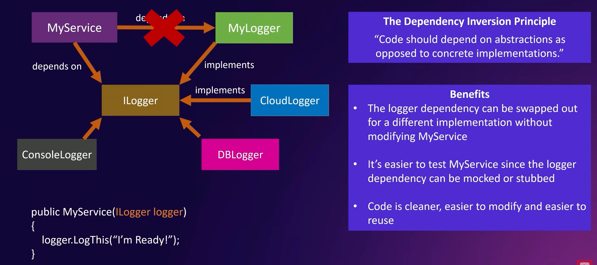
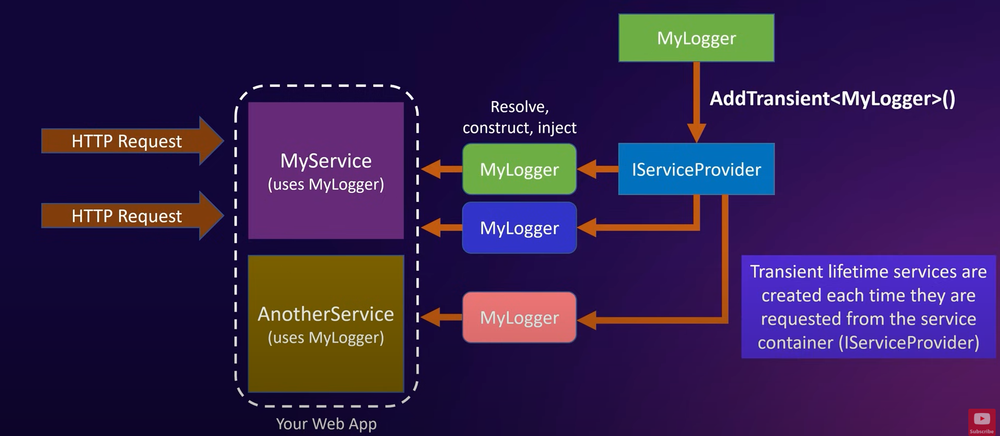

# Entity Framework Core

## The Need for Object-Relational Mapping (O/RM)


## What is Object Relational Mapping (O/RM)?


## What is Entity Framework Core?
> A lightweight, extensible, open source, and cross-platform object-relational mapper for .NET

 


----
Entities folder represent our data model

* DBContext is really an object that represents a session with database and that can be used to query and save instances of your entities


<br>

Kegunaan `GameStoreContext`: <br>


# The ASP.NET Core Configuration System
```csharp
var connString = "Data Source=GameStore.db"; // path location for sqlite db file

// register service
builder.Services.AddSqlite<GameStoreContext>(connString);
```

is not ideal to store connection string directly like that. There is betterway to store connection string: <br>


# Understanding Dependency Injection

## What is a Dependency?


## What is Dependency Injection?


## Using Dependency Inversion
> Prinsip Inversi Dependensi (Dependency Inversion Principle) menyatakan bahwa kode seharusnya bergantung pada abstraksi daripada implementasi konkret. Artinya, dalam desain perangkat lunak, kelas tingkat tinggi seharusnya tidak tergantung pada kelas tingkat rendah secara langsung. Sebaliknya, keduanya harus bergantung pada abstraksi. Dengan menerapkan prinsip ini, perubahan dalam kelas tingkat rendah (implementasi) tidak akan mempengaruhi kelas tingkat tinggi (abstraksi), sehingga memudahkan untuk mengubah atau memperluas kode dengan lebih fleksibel. Prinsip ini adalah salah satu dari lima prinsip desain solid (SOLID principles) yang dikemukakan oleh Robert C. Martin.




## When should instances be created?
 <br>


### The Transient Service Lifetime
* Let's say that my logger is a very lightweight and stateless service, so it is okay to create a new instance every single time any class need it. 
* In that case, you would register MyLogger with `AddTransient<MyLogger>()` method
 <br>

### The Scoped Service Lifetime
* What if my logger is a class that keeps track of some sort of state that needs to be shared across multiple classes that participate in an HTTP Request
* In that case, you would register MyLogger with `AddScoped<MyLogger>()` method
 <br>

### The Singleton Service Lifetime
* Let's say that MyLogger is not cheap to instantiate and it keeps track of a state that should be shared with all classes that requested during the entire lifetime of your application
* then you would register MyLogger with the `AddSingleton<MyLogger>()` method


## Info 3 Service Lifetime -chatgpt


Contoh penerapan di ASP .NET Core: <br>
```csharp
// Contoh layanan Transient
services.AddTransient<ILoggerService, LoggerService>();

// Contoh layanan Scoped
services.AddScoped<IDatabaseService, DatabaseService>();

// Contoh layanan Singleton
services.AddSingleton<IConfigurationService, ConfigurationService>();

```

Dalam contoh di atas, `LoggerService` akan dibuat ulang setiap kali diminta (transient), `DatabaseService` akan dibuat satu kali per permintaan HTTP (scoped), dan `ConfigurationService` akan dibuat sekali selama aplikasi berjalan (singleton).
