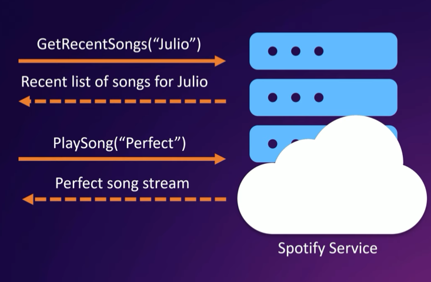
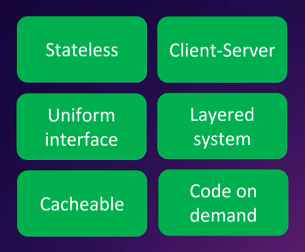
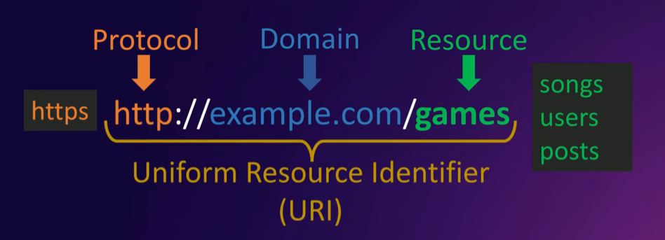
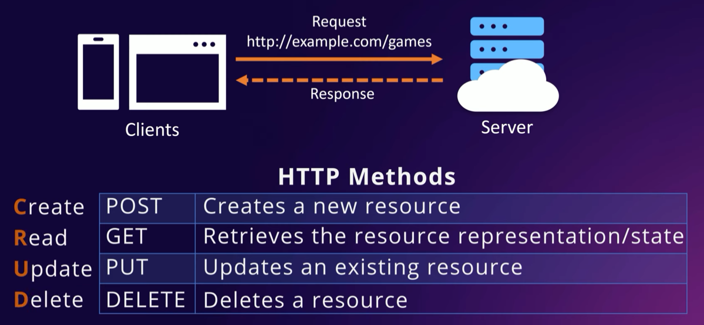
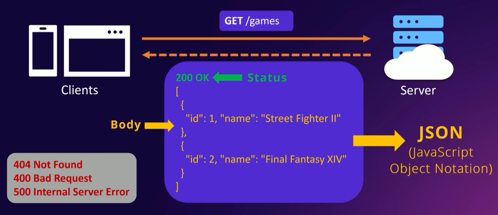
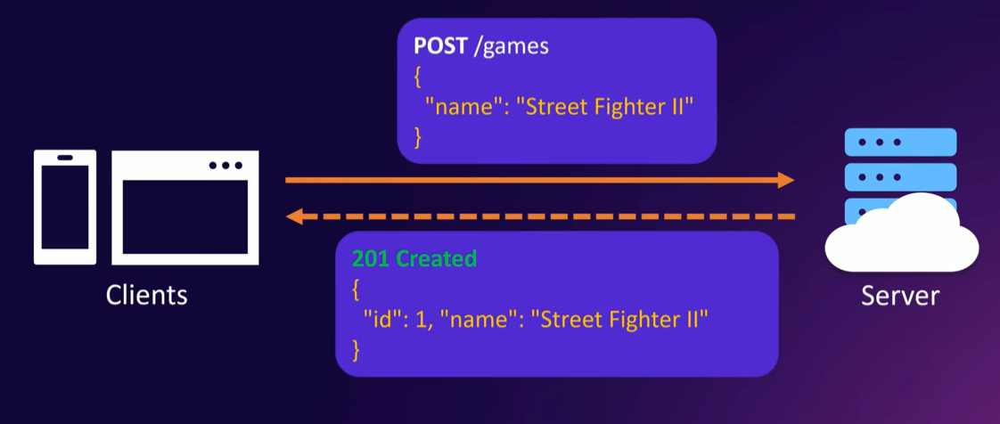
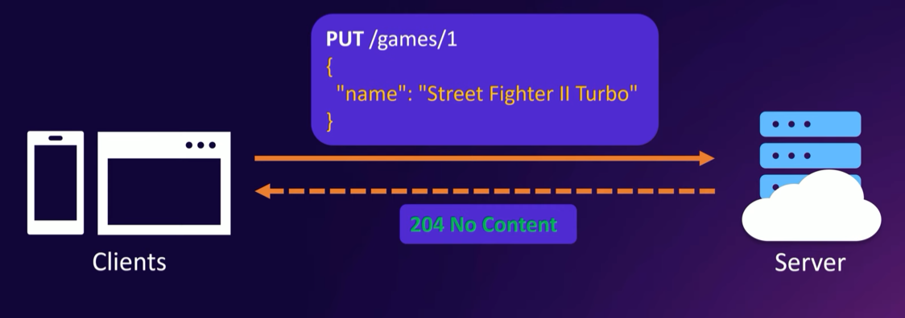
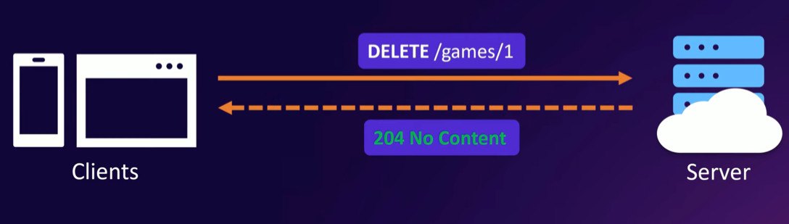
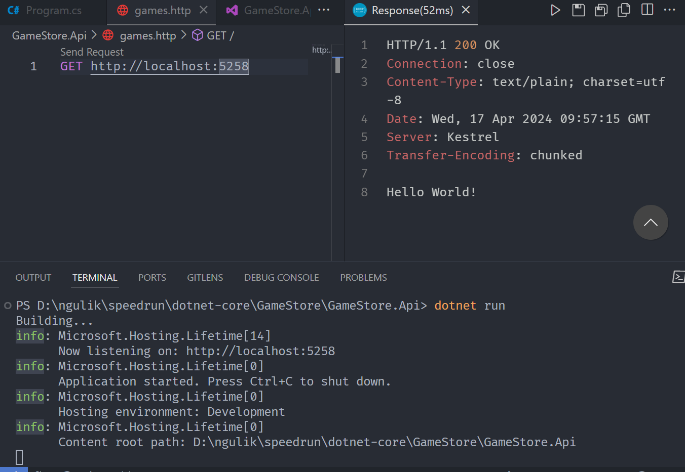

# RESTful API

## What is an API?
Application Programming Interface <br>


> An API helps clients communicate what htey want to the sevice so it can understand and fulfill the request.

## What is REST?
REpresentational State Transfer <br>
 

> A set of guiding principles that impose conditions on how an API should work

## What is a REST API?
A REST or RESTFUL API is one that conforms to the REST architectural style

## How to identify resources in a REST API?
A resources in any object, document or thing that the API can receive from or send to the clients. <br>


## How to interact with a REST API?


### Get All Games - HTTP GET
 

### GET A Specific Game - HTTP GET


### Create A Game - HTTP POST


### Update A Game - HTTP PUT
 

### Delete A Game - HTTP DELETE


### Conclusion REST API
```
GET /games
GET /games/1
POST /games
PUT /games/1
DELETE /games/1
```

## Test HTTP
* create file `games.http`: `GET <your localhost>`
* make sure you download ext REST Client
* `dotnet run`
* Send request


or just CTRL + ALT + R

---
How to prevent browser open when we are in the debugging session?
* CTRL + SHIFT + E
* launchSetting.json > `launchBrowser: false`