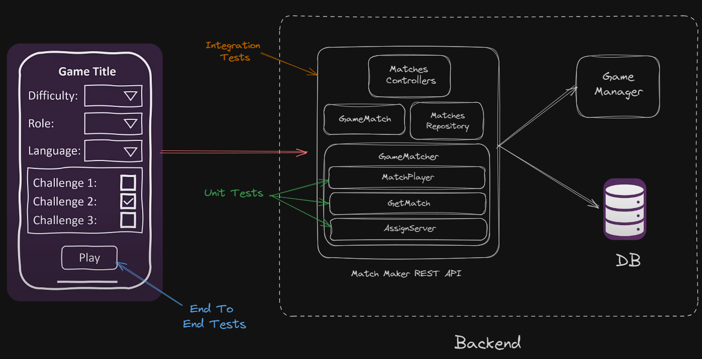
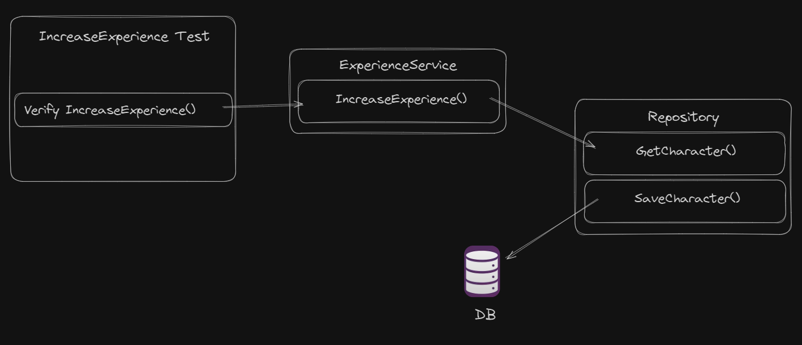

# C# Unit Test

  

Most modern application involve multiple components that go way beyond the user interface. This UI Matchmaking game is not powerful if not include backend. This backend includes the REST API that allows the app to place the matchmaking request and ultimately join players into game matches. This REST API collaborates with other services like: `Game Manager` which is the one in charge of provisioning the game servers where users will play. As many APIs do, this API also relies on a `database` to safely store all the information related to the game matches.

But if we look deeper into the matchmaker, we'll see that there are multiple components inside that group the different functionalities of the API, things like `controllers`, `entities`, `repositories`, and event the `Game Matcher` which is the core component responsible for the mathcmaking algorithm.

Lastly, if you look into `Game Matcher` component, we'll see that it provides multiple functions that allow callers to make use of its features. In testing terms, these functions are called **units**.

> **Units** are the smalles testable part of the component

so when verifying the behaviour of an application, developers usually start by creating `unit tests` which will make sure these units work properly in isolation. Later, they will develop what is known as **integration tests**

> **Integration Test** could test that the entire MatchMaker REST API works properly when it combines its multiple components with external services like the `Game Manager` and the `databases`

Finally, either developers or a dedicated test team will create **end to end tests** to verify that the entire application works properly from an end user perspective

## Different types of tests

1. Unit Tests
    * Verify a small piece of code
    * Does it quickly
    * Does it in isolation
2. Integration Tests
    * Verify the interactions between different units
    * Focus on integration with out-of-process dependencies
3. End To End Tests
    * Verify the application from start to finish
    * Validate from the user's perspective

Also here many other types of tests that can verify several other aspects of the applications:
* Performance Tests
* Security Tests
* Smoke Tests
* Acceptance Tests
* Load Tests
* Usability Tests

## What is Unit Testing?
> A software testing technique where individual units of an application are tested in isolation to ensure their function correctly.

The primary goal of unit test is to validate that each unit of the software performs as designed

## Testing Units
Le's see how this works with a smaller scenario. Let's say the unit we want to test is the `IncreaseExperience` method of our experience service class. This method should increase the experience points of the specified character in our gaming application. To test it, we create the `IncreaseExperience Unit Test` which is just a small program that will run the following verification steps:

  

## Isolating Units from external dependencies

  

What does it mean to isolate units from external dependencies? well, imagine that our experience service class makes use of a few methods in this other repository class. `IncreaseExperience` method invokes get character to load character that will receive the experience points and then invokes save character to persist updated character. The problem is that this repository class loads and saves data into an external database. 

So when our unit test involes `increase experience` method, it will end up making a few round trips to the database which is a slow and unreliable. We don't want slow nor unreliable tests, so what we do in this case is add a new step to our test where we replace reposioty class being use by experience service with a **fake repository**:

  

This fake repository still has the required `GetCharacter` and `SaveCharacter` methods but instead of interacting with a database, those method will just simulate what the real methods do for instance `GetCharacter` could return a fake instance of the character with some preconfigured values 

**Why isolate external dependencies?**
* It allows unit tests to run fast
* It prevents test from failing intermittently
* It avoids complex environment setups

## What is a unit testing framework?
> A software tool for creating, running and reporting unit tests

## Unit Testing frameworks for C# / .NET
Here are the most popular ones:
1. MSTests (Microsoft Test)
    * is the original test framework built into visual studio and that became open source starting with its second version
2. n unit
    * a widely used unit testing framework for .net which originated as a port of the popular java testing framework junit
3. x Unit.net
    * a modern extensive and more opinionated unit testing framework for the .net framework ecosystem written by the original inventor of nunit v2

**Why xUnit?**
* Cleaner and more intuitive tests
* Run tests in parallel by default 
* Used by multiple Microsoft teams (ASP.NET Core, Entity Framework, and others)